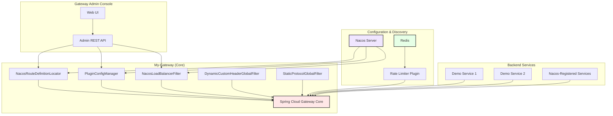

# Spring Cloud Gateway Dynamic Management Demo

A production-ready demo of dynamic API gateway management system built on Spring Cloud Gateway 2021.x + Spring Boot 3.2.4 + Nacos 2.4.3, featuring complete gateway configuration management, service discovery, route management, and plugin extension capabilities.

<div align="center">

[](https://spring.io/projects/spring-cloud-gateway)
[](https://spring.io/projects/spring-boot)
[](https://nacos.io/)
[](https://redis.io/)
[](LICENSE)

</div>

---

## 📋 Table of Contents

- [Project Overview](#-project-overview)
- [Core Features](#-core-features)
- [System Architecture](#️-system-architecture)
- [Quick Start](#-quick-start)
- [Demo Limitations](#⚠️-demo-limitations-nonproduction-ready)
- [Value & Use Cases](#-value--use-cases)
- [License](#-license)
- [Disclaimer](#-disclaimer)

---

## 📖 Project Overview

This demo implements a **dynamic gateway management system** that addresses the limitations of static Spring Cloud Gateway configurations. It provides a visual management console and real-time configuration hot update capabilities, making gateway management intuitive and efficient without service restarts.

The project is designed as a **learning and demonstration tool** (not production-ready) to showcase core Spring Cloud Gateway capabilities including dynamic routing, service discovery integration, load balancing, and plugin extensibility.

### Key Highlights

- ✨ **Visual Management Console** - No more YAML files, manage everything through web UI
- ⚡ **Real-time Hot Updates** - Configuration changes take effect immediately without restart
- 🔌 **Plugin Architecture** - Extensible plugin system for custom functionality
- 🎯 **Load Balancing** - Multiple strategies with Nacos weight-aware instance selection
- 🚀 **Service Discovery** - Native Nacos integration for dynamic service registration

---

## 🎯 Core Features

### 1. Gateway Admin Console (Web UI)

#### Service Management

- ✅ Create/delete custom services
- ✅ Configure service instances (IP, port, weight)
- ✅ Multiple load balancing strategies:
  - **Round Robin** - Even distribution across instances
  - **Weighted Round Robin** - Proportional distribution based on weights
  - **Least Connections** - Route to instance with fewest active connections
  - **Random** - Random instance selection
- ✅ Nacos service discovery integration
- ✅ Real-time service instance monitoring

#### Route Management

- ✅ Create/delete dynamic routes
- ✅ Two target types supported:
  - Pre-configured custom services
  - Nacos-registered services (lb:// protocol)
- ✅ Multiple predicate configurations:
  - **Path** - URL path pattern matching (e.g., `/api/**`)
  - **Host** - Host header matching (e.g., `*.example.com`)
  - **Method** - HTTP method matching (GET, POST, PUT, DELETE)
  - **Header** - Custom header matching
- ✅ Filter configurations:
  - **StripPrefix** - Remove path prefixes
  - **AddRequestHeader** - Inject request headers
  - **RewritePath** - Path transformation with regex
- ✅ Rate limiting plugin configuration
- ✅ Custom Header plugin support
- ✅ Real-time route configuration refresh (hot update)

#### Plugin Management

- ✅ **Rate Limiter Plugin** (Redis-based token bucket algorithm)
  - Configurable QPS limits per route
  - Route-level independent configuration
  - Burst traffic handling
- ✅ **Custom Header Plugin**
  - Dynamically add request headers
  - Variable placeholder support:
    - `${random.uuid}` - Random UUID generation
    - `${client.ip}` - Client IP extraction
    - `${request.path}` - Request path extraction
  - Multiple key-value pairs support
- ✅ Real-time plugin configuration activation

#### Web Interface

- ✅ Full English UI with modern design
- ✅ Visual operation panel with step-by-step guide
- ✅ Real-time status display
- ✅ One-click configuration refresh
- ✅ Responsive layout

---

### 2. My-Gateway (Gateway Core Service)

#### Custom Global Filter Chain

**NacosLoadBalancerFilter** (Order: 10150)
- ✅ Replaces Spring Cloud Gateway's default ReactiveLoadBalancerClientFilter
- ✅ Direct Nacos service discovery integration
- ✅ Healthy instance filtering (automatic unhealthy instance exclusion)
- ✅ Multiple load balancing strategies implementation
- ✅ Weight-aware instance selection from Nacos metadata

**DynamicCustomHeaderGlobalFilter** (Order: 10250)
- ✅ Dynamically add custom headers from Nacos configuration
- ✅ Variable resolution (UUID, client IP, request path)
- ✅ Executes after load balancing (route confirmed)
- ✅ Non-intrusive processing (errors don't block requests)

**StaticProtocolGlobalFilter** (Order: 10001)
- ✅ `static://` protocol support for static node routing
- ✅ Service instance resolution from `gateway-services.json`
- ✅ Local cache with TTL (10 seconds)
- ✅ Nacos configuration change listening (hot update)
- ✅ Automatic cache clearing on configuration deletion

**CustomLoadBalancerGatewayFilterFactory**
- ✅ Custom load balancing filter factory
- ✅ `static://` and `lb://` protocol support
- ✅ Configurable load balancing strategies per route

#### Plugin System

**PluginConfigManager**
- ✅ Listens to `gateway-plugins.json` in Nacos
- ✅ Dynamic plugin configuration parsing and loading
- ✅ Hot update of plugin configurations
- ✅ Plugin configuration query API

**NacosPluginConfigListener**
- ✅ Nacos configuration change monitoring
- ✅ Automatic configuration reload
- ✅ Cleanup on configuration deletion

#### Route Locator

**NacosRouteDefinitionLocator**
- ✅ Dynamic route configuration loading from Nacos
- ✅ Multiple JSON format support:
  - `{"routes": [...]}` - Wrapped array format
  - `[...]` - Direct array format
  - `{routeId: {...}}` - Map format
- ✅ Route configuration cache (TTL: 10 seconds)
- ✅ Configuration change listening (hot update)
- ✅ Cache clearing functionality

---

### 3. Demo Service (Sample Backend Service)

#### Test Endpoints

- ✅ `/hello` - Simple greeting endpoint
- ✅ `/api/headers` - Returns request headers (verify custom header plugin)
- ✅ `/api/info` - Returns service metadata and instance information

#### Purpose

- ✅ Validate gateway route configurations
- ✅ Test custom header plugin functionality
- ✅ Demonstrate load balancing effects
- ✅ Serve as sample backend service for testing

---

### 4. Nacos Integration (Config & Service Registry)

#### Configuration Management

- ✅ `gateway-routes.json` - Dynamic route configurations
- ✅ `gateway-services.json` - Static service configurations
- ✅ `gateway-plugins.json` - Plugin configurations
- ✅ Configuration version management
- ✅ Configuration change history tracking

#### Service Discovery

- ✅ Service registration with health checks
- ✅ Service instance weight configuration
- ✅ Service list query and filtering
- ✅ Namespace isolation support

---

## 🏗️ System Architecture



### Project Structure

```
spring-cloud-gateway-demo/
├── gateway-admin/              # Web management console
│   ├── src/main/java/          # Admin backend (Spring Boot)
│   │   └── com/example/gatewayadmin/
│   │       ├── controller/     # REST controllers
│   │       ├── model/          # Data models
│   │       ├── service/        # Business logic
│   │       └── config/         # Configuration classes
│   └── src/main/resources/
│       ├── templates/          # Thymeleaf templates
│       └── application.yml
├── my-gateway/                 # Gateway core service
│   ├── src/main/java/com/example/mygateway/
│   │   ├── filter/             # Custom global filters
│   │   │   ├── NacosLoadBalancerFilter.java
│   │   │   ├── DynamicCustomHeaderGlobalFilter.java
│   │   │   ├── StaticProtocolGlobalFilter.java
│   │   │   └── CustomLoadBalancerGatewayFilterFactory.java
│   │   ├── locator/            # Dynamic route locator
│   │   │   └── NacosRouteDefinitionLocator.java
│   │   ├── plugin/             # Plugin system
│   │   │   └── PluginConfigManager.java
│   │   └── config/             # Gateway configurations
│   │       └── NacosPluginConfigListener.java
│   └── src/main/resources/
├── demo-service/               # Sample backend service
│   └── src/main/java/com/example/demoservice/
└── nacos/                      # Nacos server (external dependency)
```

---

## 🚀 Quick Start

### Prerequisites

- **JDK 17+** (required for Spring Boot 3.2.x)
- **Maven 3.8+**
- **Nacos 2.4.3** (standalone mode for demo)
- **Redis 6.0+** (for rate limiter plugin)
- **Node.js 18+** (optional, for UI customization)

### Step 1: Start Dependencies

#### 1.1 Start Nacos Server

```bash
# Extract Nacos package
unzip nacos-server-2.4.3.zip
cd nacos/bin

# Start standalone mode
# Linux/Mac
sh startup.sh -m standalone

# Windows
startup.cmd -m standalone
```

- Access Nacos Console: http://localhost:8848/nacos
- Default credentials: `nacos` / `nacos`

#### 1.2 Start Redis

```bash
# Start Redis (default port 6379)
redis-server

# Or using Docker
docker run -d -p 6379:6379 redis:latest
```

### Step 2: Configure Nacos

Create the following configuration files in Nacos Console (Namespace: **public**):

#### 2.1 gateway-routes.json

```json
{
  "version": "1.0",
  "routes": [
    {
      "id": "user-route",
      "uri": "lb://user-service",
      "predicates": [
        {
          "name": "Path",
          "args": {
            "pattern": "/api/users/**"
          }
        }
      ],
      "filters": [
        {
          "name": "StripPrefix",
          "args": {
            "parts": "1"
          }
        }
      ]
    }
  ]
}
```

#### 2.2 gateway-services.json

```json
{
  "version": "1.0",
  "services": [
    {
      "name": "user-service",
      "loadBalancer": "round-robin",
      "instances": [
        {
          "ip": "127.0.0.1",
          "port": 8081,
          "weight": 1.0,
          "healthy": true,
          "enabled": true
        }
      ]
    }
  ]
}
```

#### 2.3 gateway-plugins.json

```json
{
  "plugins": {
    "customHeaders": [
      {
        "routeId": "user-route",
        "enabled": true,
        "headers": {
          "X-Request-Id": "${random.uuid}",
          "X-Forwarded-For": "${client.ip}"
        }
      }
    ]
  }
}
```

### Step 3: Build and Start Services

#### 3.1 Start Demo Service

```bash
cd demo-service
mvn clean package
java -jar target/demo-service-1.0.0.jar
```

- Default port: **8081**

#### 3.2 Start My-Gateway

```bash
cd my-gateway
mvn clean package
java -jar target/my-gateway-1.0.0.jar
```

- Default port: **80** (requires admin privileges) or **8080**
- Nacos server: `127.0.0.1:8848`

#### 3.3 Start Gateway Admin

```bash
cd gateway-admin
mvn clean package
java -jar target/gateway-admin-1.0.0.jar
```

- Default port: **8081**

### Step 4: Access Consoles

| Component | URL | Description |
|-----------|-----|-------------|
| **Gateway Admin Console** | http://localhost:8081 | Web management UI |
| **Gateway API** | http://localhost:80 | Gateway entry point |
| **Demo Service** | http://localhost:8081 | Sample backend service |
| **Nacos Console** | http://localhost:8848/nacos | Configuration management |

### Step 5: Verify Functionality

1. **Access Gateway Admin Console** (http://localhost:8081)
2. **Create a test route** via the web UI
3. **Test the route**:
   ```bash
   curl http://localhost:80/api/headers
   ```
4. **Check response headers** for custom headers (X-Request-Id, etc.)

---

## ⚠️ Demo Limitations (Non-Production Ready)

This demo is for **learning and demonstration purposes only**. It lacks critical enterprise-grade features required for production deployment:

### Security & Authentication ❌
- User authentication/authorization system
- RBAC permission control
- JWT/OAuth2 integration
- API access authentication
- IP whitelist/blacklist
- CORS configuration management
- SSL/TLS certificate management
- Request signature verification

### Rate Limiting & Circuit Breaking ❌
- Distributed rate limiting (Redis cluster)
- Sentinel integration
- Hystrix/Resilience4j circuit breaking
- Bulkhead pattern implementation
- Slow call ratio circuit breaking
- Exception ratio circuit breaking
- Hot parameter rate limiting
- Adaptive rate limiting

### Timeout & Retry ❌
- Global timeout configuration
- Route-level timeout settings
- Automatic retry mechanism
- Retry backoff strategies (exponential, fixed)
- Failover and fallback mechanisms
- Idempotency handling

### Monitoring & Observability ❌
- Prometheus metrics collection
- Grafana dashboard templates
- Custom business metrics
- Alert rule configuration
- Alert notifications (Email/SMS/DingTalk/Slack)
- Distributed tracing (Sleuth/Zipkin/Jaeger)
- Health check endpoints
- Performance profiling

### Advanced Routing ❌
- Canary release/blue-green deployment
- A/B testing routing
- Traffic mirroring and replay
- Request/response transformation
- Protocol conversion (HTTP → gRPC/WebSocket)
- WebSocket support
- Server-Sent Events (SSE)
- GraphQL integration

### High Availability ❌
- Gateway cluster deployment
- Configuration persistence (database)
- Nacos cluster setup
- Redis cluster for rate limiting
- Load balancing (Nginx/SLB)
- Auto-scaling configuration
- Disaster recovery planning

### Developer Experience ❌
- API documentation (Swagger/OpenAPI)
- API versioning strategy
- Request validation framework
- Unified exception handling
- Unified response format
- Data masking/desensitization
- Anti-replay attack protection
- Rate limiting by API key

### Operations ❌
- Configuration import/export
- Batch operations
- Configuration rollback
- Configuration comparison
- Multi-environment management (Dev/Test/Prod)
- Configuration templates
- Audit logging
- Change management workflow

---

## 🎓 Value & Use Cases

### Suitable Scenarios

1. **Learning Spring Cloud Gateway** - Understand core concepts and architecture
2. **Prototype Development** - Quickly validate gateway configurations
3. **Educational Demonstrations** - Teach gateway patterns and best practices
4. **Proof of Concept** - Evaluate Spring Cloud Gateway for your organization
5. **Foundation for Enterprise Gateway** - Starting point for production implementation

### Feature Implementation Priority (For Production)

#### P0 - Critical Essentials
1. ✅ User authentication & authorization (OAuth2/JWT)
2. ✅ Distributed rate limiting (Redis cluster)
3. ✅ Timeout & retry mechanisms
4. ✅ Prometheus + Grafana monitoring

#### P1 - Important Enhancements
5. ✅ Distributed tracing (Sleuth + Zipkin)
6. ✅ Circuit breaking (Sentinel/Resilience4j)
7. ✅ Response caching with Redis
8. ✅ Comprehensive audit logging

#### P2 - Advanced Features
9. ✅ Canary releases and blue-green deployment
10. ✅ Mock service for testing
11. ✅ Multi-environment configuration management
12. ✅ Plugin marketplace and versioning

#### P3 - Enterprise Grade
13. ✅ High availability cluster deployment
14. ✅ Performance tuning and optimization
15. ✅ Full API lifecycle management
16. ✅ Advanced security features (WAF, DDoS protection)

---

## 📄 License

This project is licensed under the **MIT License** - see the [LICENSE](LICENSE) file for details.

### What You Can Do

- ✅ Use for personal projects
- ✅ Use for commercial projects
- ✅ Modify and distribute
- ✅ Create derivative works
- ✅ Sell copies

### What You Must Do

- ⚠️ Include original license
- ⚠️ Mention original authors
- ⚠️ State significant changes

---

## 📝 Disclaimer

This software is provided **"as is"** without warranty of any kind, express or implied, including but not limited to the warranties of merchantability, fitness for a particular purpose, and noninfringement.

**In no event shall the authors be liable for any claim, damages, or other liability arising from:**
- Use of this software in production environments
- Loss of data or profits
- Business interruption
- Any other commercial damages or losses

**Important Notes:**
- This is a **demo project** for educational purposes
- **Do NOT use in production** without significant enhancements
- Always test thoroughly in staging environments
- Consult with security professionals before production deployment

---

## 🤝 Contributing

Contributions are welcome! Please feel free to submit a Pull Request.

### How to Contribute

1. Fork the repository
2. Create your feature branch (`git checkout -b feature/AmazingFeature`)
3. Commit your changes (`git commit -m 'Add some AmazingFeature'`)
4. Push to the branch (`git push origin feature/AmazingFeature`)
5. Open a Pull Request

### Development Guidelines

- Follow existing code style
- Write meaningful commit messages
- Add comments for complex logic
- Update documentation as needed
- Test your changes thoroughly

---

## 📧 Contact

- **Project Link**: [https://github.com/yourusername/spring-cloud-gateway-demo](https://github.com/yourusername/spring-cloud-gateway-demo)
- **Author**: leoli

---

## 🙏 Acknowledgments

- [Spring Cloud Gateway](https://spring.io/projects/spring-cloud-gateway)
- [Spring Boot](https://spring.io/projects/spring-boot)
- [Nacos](https://nacos.io/)
- [Redis](https://redis.io/)

---

<div align="center">

**Made with ❤️ by leoli**

If you find this project helpful, please give it a ⭐ Star on GitHub!

</div>
