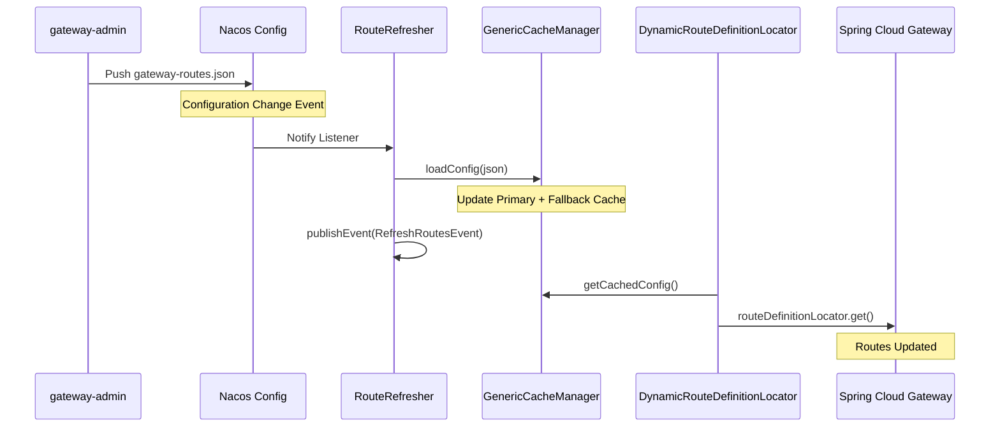
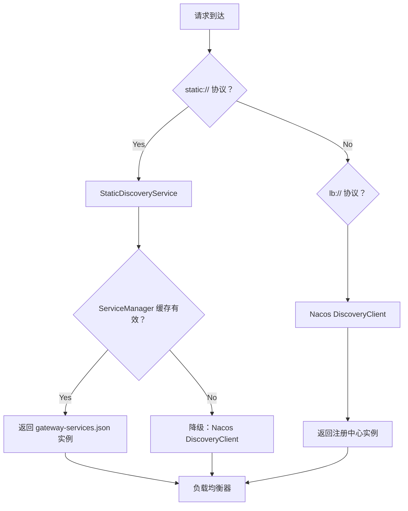
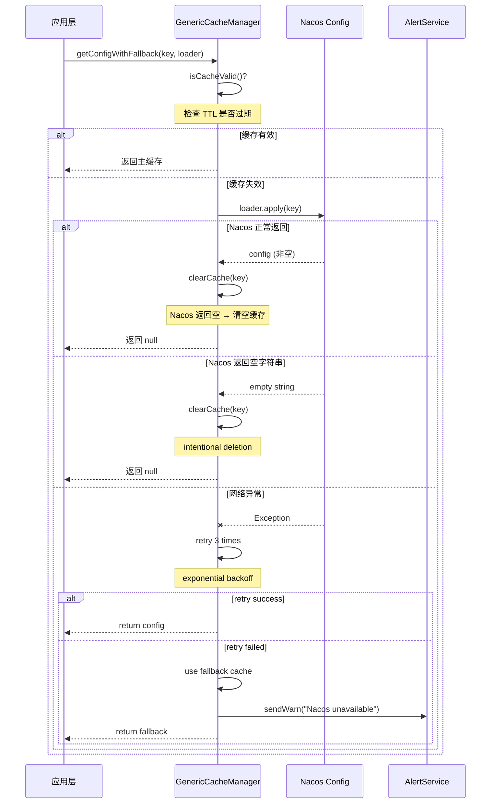
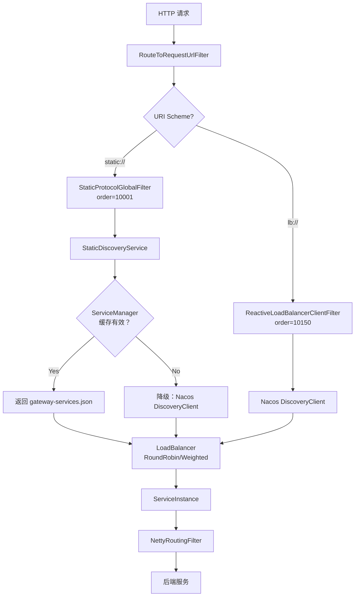
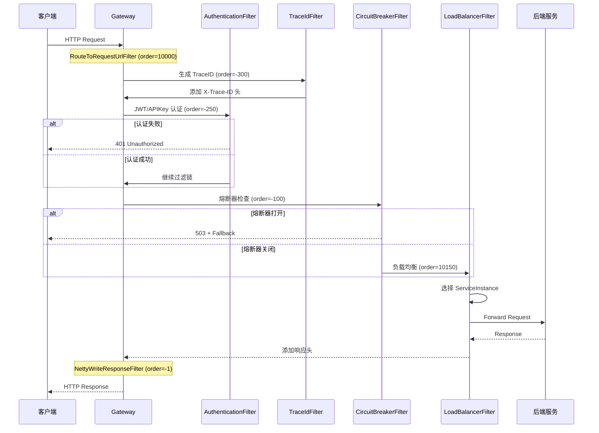
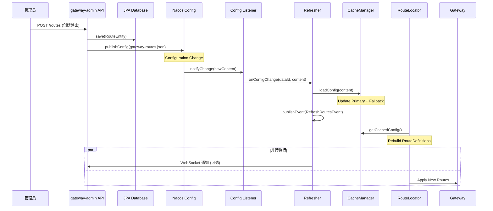

# Spring Cloud Gateway 动态路由管理架构设计文档

> **项目地址**: https://github.com/leoli5295/scg-dynamic-admin-demo  
> **作者**: leoli5295  
> **技术栈**: Spring Cloud Gateway 4.1 + Nacos 2.x + Spring Boot 3.2

---

## 目录

- [1. 项目概述](#1-项目概述)
- [2. 整体架构](#2-整体架构)
- [3. 核心功能模块](#3-核心功能模块)
- [4. 缓存架构设计](#4-缓存架构设计)
- [5. 负载均衡设计](#5-负载均衡设计)
- [6. 配置中心集成](#6-配置中心集成)
- [7. 数据流转到](#7-数据流转到)
- [8. 部署架构](#8-部署架构)

---

## 1. 项目概述

### 1.1 项目简介

本项目是一个**企业级 Spring Cloud Gateway 动态路由管理解决方案**,提供完整的路由管理、服务发现、策略配置能力。通过双模块架构 (`gateway-admin` + `my-gateway`) 实现管理平面与数据平面的解耦，支持 Nacos 和 Consul 双配置中心。

### 1.2 核心特性

✅ **动态路由管理** - 支持路由配置的实时增删改查，秒级同步到网关  
✅ **双配置中心支持** - Nacos/Consul自动切换，适配多云环境  
✅ **智能缓存机制** - 主缓存 + 降级缓存 + 定时同步，确保 Nacos 宕机零 404  
✅ **混合负载均衡** - 支持静态配置 (`static://`) 和动态发现 (`lb://`) 双协议  
✅ **企业级可观测性** - 分级告警、缓存预热、健康检查、审计日志  
✅ **零注册服务发现** - 网关不注册到 Nacos，仅作为消费者，降低耦合

### 1.3 技术栈

| 组件 | 版本 | 说明 |
|------|------|------|
| Spring Boot | 3.2.4 | 基础框架 |
| Spring Cloud Gateway | 4.1.0 | 网关核心 |
| Spring Cloud Alibaba | 2023.0.0.0-RC1 | Nacos 集成 |
| Nacos | 2.x | 配置中心 + 服务发现 |
| Consul | 1.x | 备选配置中心 |
| Resilience4j | 2.1.0 | 熔断限流 |
| JWT (jjwt) | 0.12.3 | 认证鉴权 |
| Lombok | - | 代码简化 |

---

## 2. 整体架构

### 2.1 双模块架构

```
┌─────────────────────────────────────────────────────────┐
│                    管理平面 (Admin Plane)                │
│  ┌────────────────────────────────────────────────────┐ │
│  │           gateway-admin (管理控制台)                │ │
│  │  - REST API (CRUD Routes/Services/Strategies)      │ │
│  │  - Web UI (可选前端界面)                            │ │
│  │  - JPA Repository (本地持久化)                      │ │
│  │  - ConfigCenterService (推送配置到 Nacos/Consul)    │ │
│  └────────────────────────────────────────────────────┘ │
└─────────────────────────────────────────────────────────┘
                         │
                         │ Push Config (JSON)
                         ▼
┌─────────────────────────────────────────────────────────┐
│              配置中心 (Config Center)                    │
│         Nacos / Consul (gateway-routes.json)            │
└─────────────────────────────────────────────────────────┘
                         │
                         │ Listen & Pull
                         ▼
┌─────────────────────────────────────────────────────────┐
│                    数据平面 (Data Plane)                 │
│  ┌────────────────────────────────────────────────────┐ │
│  │              my-gateway (运行时网关)                │ │
│  │  - DynamicRouteDefinitionLocator (路由加载)        │ │
│  │  - GenericCacheManager<T> (统一缓存)               │ │
│  │  - StaticDiscoveryService (服务发现)               │ │
│  │  - DiscoveryLoadBalancerFilter (负载均衡)          │ │
│  │  - Auth/CircuitBreaker/Timeout Filters (策略)      │ │
│  └────────────────────────────────────────────────────┘ │
└─────────────────────────────────────────────────────────┘
```

### 2.2 架构分层

```
┌──────────────────────────────────────────────────────┐
│                 Web 层 (Controller)                   │
│  RouteController | ServiceController | StrategyCtrl  │
├──────────────────────────────────────────────────────┤
│                 服务层 (Service)                      │
│  RouteService | ServiceService | StrategyService     │
├──────────────────────────────────────────────────────┤
│               持久层 (Repository/JPA)                 │
│  RouteRepository | ServiceRepository | ...           │
├──────────────────────────────────────────────────────┤
│          配置中心抽象层 (ConfigCenterService)         │
│  NacosConfigCenterService | ConsulConfigCenterService│
└──────────────────────────────────────────────────────┘
```

---

## 3. 核心功能模块

### 3.1 路由管理模块

#### 3.1.1 路由实体设计

```java
// gateway-admin/model/RouteEntity.java
@Entity
@Table(name = "t_route")
public class RouteEntity {
    @Id
    @GeneratedValue(strategy = GenerationType.IDENTITY)
    private Long id;
    
    private String routeId;        // 路由唯一标识
    private String uri;            // 目标地址 (lb://service-name 或 static://service-name)
    private Integer order;         // 路由顺序
    private Boolean enabled;       // 是否启用
    
    @ElementCollection(fetch = FetchType.EAGER)
    @CollectionTable(name = "t_route_predicates")
    private List<PredicateDefinition> predicates;  // 断言列表
    
    @ElementCollection(fetch = FetchType.EAGER)
    @CollectionTable(name = "t_route_filters")
    private List<FilterDefinition> filters;        // 过滤器列表
    
    @ElementCollection(fetch = FetchType.EAGER)
    @CollectionTable(name = "t_route_metadata")
    private Map<String, String> metadata;          // 元数据
}
```

#### 3.1.2 路由刷新流程



#### 3.1.3 关键类

| 类名 | 职责 | 所在模块 |
|------|------|---------|
| `DynamicRouteDefinitionLocator` | 动态路由定义定位器 | my-gateway |
| `RouteRefresher` | 路由配置刷新器 (监听 Nacos) | my-gateway |
| `RouteSyncScheduler` | 定时同步任务 (30 分钟) | my-gateway |
| `RouteManager` | 路由配置管理器 | my-gateway |
| `RouteService` | 路由业务服务 (CRUD) | gateway-admin |
| `RouteRepository` | JPA 数据访问层 | gateway-admin |

### 3.2 服务发现模块

#### 3.2.1 双协议支持

**`static://` 协议** - 静态配置，从 `gateway-services.json` 读取固定节点

```json
{
  "services": [
    {
      "name": "user-service",
      "instances": [
        {"ip": "127.0.0.1", "port": 9000, "weight": 1},
        {"ip": "127.0.0.1", "port": 9001, "weight": 5}
      ],
      "loadBalancer": "weighted"
    }
  ]
}
```

**`lb://` 协议** - 动态发现，从 Nacos 服务注册中心获取实例

```yaml
# application.yml
spring:
  cloud:
    nacos:
      discovery:
        server-addr: 127.0.0.1:8848
```

#### 3.2.2 服务发现优先级



#### 3.2.3 关键类

| 类名 | 职责 | 依赖关系 |
|------|------|---------|
| `StaticDiscoveryService` | 服务发现统一入口 | ServiceManager + DiscoveryClient |
| `ServiceManager` | 静态服务配置管理 | GenericCacheManager |
| `ServiceRefresher` | 服务配置刷新器 | ConfigCenterService |
| `ServiceSyncScheduler` | 定时同步任务 | ServiceRefresher |

### 3.3 策略管理模块

#### 3.3.1 支持的策略类型

| 策略类型 | 说明 | 实现 Filter |
|---------|------|------------|
| **AUTH** | 认证鉴权 | `AuthenticationGlobalFilter`, `ApiKeyAuthProcessor` |
| **TRACING** | 链路追踪 | `TraceIdGlobalFilter` |
| **CIRCUIT_BREAKER** | 熔断降级 | `CircuitBreakerGlobalFilter` |
| **TIMEOUT** | 超时控制 | `TimeoutGlobalFilter` |
| **RATE_LIMIT** | 限流 (Redis) | (可选扩展) |

#### 3.3.2 策略执行链

```
OrderedGatewayFilter.filter (order=0)
  ├─ TraceIdGlobalFilter (order=-300)     # 生成 TraceID
  ├─ IPFilterGlobalFilter (order=-280)    # IP 黑白名单
  ├─ AuthenticationGlobalFilter (order=-250)  # JWT/APIKey 认证
  ├─ TimeoutGlobalFilter (order=-200)     # 超时控制
  ├─ CircuitBreakerGlobalFilter (order=-100) # 熔断降级
  └─ RouteToRequestUrlFilter (order=10000)   # 路由转换
```

---

## 4. 缓存架构设计

### 4.1 三级缓存体系

```
┌─────────────────────────────────────────────────────┐
│              L1: 内存缓存 (ConcurrentHashMap)        │
│  RouteManager.endpointCache / instanceCache         │
│  特点：纳秒级读取，进程内缓存                        │
├─────────────────────────────────────────────────────┤
│              L2: GenericCacheManager                 │
│  - primaryCaches: 主缓存 (当前有效配置)              │
│  - fallbackCaches: 降级缓存 (最后成功配置)           │
│  特点：支持 TTL、支持降级、支持重试                  │
├─────────────────────────────────────────────────────┤
│              L3: 配置中心 (Nacos/Consul)             │
│  gateway-routes.json / gateway-services.json         │
│  特点：持久化、分布式共享、最终一致性                │
└─────────────────────────────────────────────────────┘
```

### 4.2 GenericCacheManager 核心设计

#### 4.2.1 双缓存结构

```java
// my-gateway/cache/GenericCacheManager.java
@Component
public class GenericCacheManager<T> {
    // 主缓存：当前有效的配置
    private final Map<String, T> primaryCaches = new ConcurrentHashMap<>();
    
    // 降级缓存：最后一次成功的配置 (Nacos 宕机时使用)
    private final Map<String, T> fallbackCaches = new ConcurrentHashMap<>();
    
    // 缓存时间戳：用于 TTL 检查
    private final Map<String, Long> cacheTimestamps = new ConcurrentHashMap<>();
    
    @Value("${gateway.cache.ttl-ms:300000}")
    private long cacheTtlMs; // 默认 5 分钟
}
```

#### 4.2.2 智能回源逻辑



#### 4.2.3 缓存一致性保证

| 场景 | Nacos 返回值 | 缓存操作 | 说明 |
|------|-----------|---------|------|
| **正常更新** | JSON 配置 | 更新主缓存 | 标准流程 |
| **配置删除** | 空字符串 `""` | 清空主缓存 + 降级缓存 | Intentional deletion |
| **网络抖动** | Exception | 保持降级缓存 | 发送 WARN 告警 |
| **Nacos 宕机** | ConnectionException | 使用降级缓存 | 发送 ERROR 告警 |
| **缓存过期** | TTL 超时 | 触发回源 | 自动 refresh |

### 4.3 缓存预热机制

```java
// ServiceRefresher.java
@PostConstruct
public void init() {
    configService.addListener(DATA_ID, GROUP, listener);
    loadInitialConfig();  // 加载初始配置
    warmupCache();        // 🔥 启动预热
}

private void warmupCache() {
    log.info("🔥 Warming up service cache on startup...");
    try {
        reloadConfigFromNacos();
        log.info("✅ Service cache warmed up successfully");
    } catch (Exception e) {
        log.warn("⚠️ Service cache warmup failed, will load on first request");
    }
}
```

**预热的好处**:
- ✅ 避免冷启动导致的第一个请求延迟
- ✅ 提前暴露 Nacos 连接问题
- ✅ 确保网关启动即可用

### 4.4 定时同步任务 (已修复)

#### 修复前的问题

```java
// ❌ 旧代码：直接调用 reloadConfigFromNacos(),不走智能回源逻辑
@Scheduled(fixedRate = 1800000)
public void syncServicesFromNacos() {
    serviceRefresher.reloadConfigFromNacos();  // 不会重试！不会降级！
}
```

**问题**:
- ❌ 网络异常时不会重试
- ❌ Nacos 宕机时清空缓存而不是使用降级配置
- ❌ 绕过了 `GenericCacheManager` 的双缓存机制

#### 修复后的正确实现

```java
// ✅ 新代码：使用 GenericCacheManager.getConfigWithFallback()
@Scheduled(fixedRate = 1800000)
public void syncServicesFromNacos() {
    JsonNode config = cacheManager.getConfigWithFallback(
        CACHE_KEY, 
        key -> configService.getConfig(DATA_ID, GROUP)
    );
    
    if (config != null) {
        log.info("✅ Scheduled sync completed: {} services", config.get("services").size());
    } else {
        log.warn("⚠️ No configuration available (deleted or never loaded)");
    }
}
```

**修复效果**:
- ✅ 自动重试 3 次 (指数退避)
- ✅ Nacos 宕机时使用降级缓存
- ✅ 仅当 Nacos 返回空字符串时才清空缓存
- ✅ 更新主缓存 + 降级缓存

#### 定时同步的作用

- ✅ 修复可能的缓存不一致
- ✅ 捕获 Nacos 配置的手动变更
- ✅ 作为监听器的冗余备份
- ✅ **现在具备完整的智能回源能力**

---

## 5. 负载均衡设计

### 5.1 混合负载均衡架构



### 5.2 ServiceInstanceListSupplier 实现

#### 5.2.1 NacosServiceInstanceListSupplier

```java
// NacosLoadBalancerConfig.java
@Bean
@Primary
public ServiceInstanceListSupplier nacosServiceInstanceListSupplier(
    DiscoveryClient discoveryClient) {
    return new NacosServiceInstanceListSupplier(discoveryClient);
}

private static class NacosServiceInstanceListSupplier 
    implements ServiceInstanceListSupplier {
    
    private final DiscoveryClient discoveryClient;
    
    @Override
    public Flux<List<ServiceInstance>> get(Request request) {
        String serviceId = extractServiceId(request);
        List<ServiceInstance> instances = 
            discoveryClient.getInstances(serviceId);
        return Flux.just(instances);
    }
}
```

#### 5.2.2 StaticServiceInstanceListSupplier

```java
// StaticLoadBalancerConfig.java
@Bean
public ServiceInstanceListSupplier staticServiceInstanceListSupplier(
    StaticDiscoveryService staticDiscoveryService) {
    return new StaticServiceInstanceListSupplier(staticDiscoveryService);
}

private static class StaticServiceInstanceListSupplier 
    implements ServiceInstanceListSupplier {
    
    private final StaticDiscoveryService staticDiscoveryService;
    
    @Override
    public Flux<List<ServiceInstance>> get(Request request) {
        String serviceId = extractServiceId(request);
        List<ServiceInstance> instances = 
            staticDiscoveryService.getInstances(serviceId);
        return Flux.just(instances);
    }
}
```

### 5.3 加权轮询算法

```java
// ServiceManager.java
public ServiceInstance selectByWeightedRoundRobin(String serviceName) {
    List<ServiceInstance> instances = instanceCache.get(serviceName);
    
    // 1. 计算总权重
    int totalWeight = instances.stream()
        .mapToInt(ServiceInstance::getWeight)
        .sum();
    
    // 2. 平滑加权轮询
    AtomicInteger counter = roundRobinCounters.get(serviceName);
    int currentIndex = Math.abs(counter.getAndIncrement() % totalWeight);
    
    // 3. 按权重选择实例
    int currentWeight = 0;
    for (ServiceInstance instance : instances) {
        currentWeight += instance.getWeight();
        if (currentIndex < currentWeight) {
            return instance;
        }
    }
    
    return instances.get(0); // Fallback
}
```

---

## 6. 配置中心集成

### 6.1 双配置中心 SPI

```java
// ConfigCenterService.java
public interface ConfigCenterService {
    String getConfig(String dataId, String group);
    void publishConfig(String dataId, String group, String content);
    void addListener(String dataId, String group, ConfigListener listener);
    void removeListener(String dataId, String group, ConfigListener listener);
    String getCenterType(); // "nacos" | "consul"
    
    interface ConfigListener {
        void onChange(String dataId, String group, String newContent);
    }
}
```

### 6.2 Nacos 实现

```java
// NacosConfigService.java
@Component
@ConditionalOnProperty(name = "gateway.center.type", havingValue = "nacos")
public class NacosConfigService implements ConfigCenterService {
    
    private final com.alibaba.nacos.api.config.ConfigService configService;
    
    @Override
    public String getConfig(String dataId, String group) {
        return configService.getConfig(dataId, group);
    }
    
    @Override
    public void publishConfig(String dataId, String group, String content) {
        configService.publishConfig(dataId, group, content);
    }
    
    @Override
    public void addListener(String dataId, String group, ConfigListener listener) {
        configService.addListener(dataId, group, (dataId1, group1, newContent) -> {
            listener.onChange(dataId1, group1, newContent);
        });
    }
}
```

### 6.3 Consul 实现

```java
// ConsulConfigService.java
@Component
@ConditionalOnProperty(name = "gateway.center.type", havingValue = "consul")
public class ConsulConfigService implements ConfigCenterService {
    
    private final ConsulClient consulClient;
    
    @Override
    public String getConfig(String dataId, String group) {
        String key = buildKey(dataId, group);
        Response<Value> response = consulClient.getKVValue(key).getValue();
        return response != null ? response.getValueAsString() : null;
    }
    
    @Override
    public void publishConfig(String dataId, String group, String content) {
        String key = buildKey(dataId, group);
        consulClient.setKVValue(key, content).getValue();
    }
}
```

### 6.4 配置格式规范

#### 6.4.1 路由配置 (gateway-routes.json)

```json
{
  "version": "1.0",
  "routes": [
    {
      "id": "user-route",
      "uri": "lb://user-service",
      "predicates": [
        {"name": "Path", "args": {"pattern": "/api/user/**"}}
      ],
      "filters": [
        {"name": "StripPrefix", "args": {"parts": 1}},
        {"name": "CircuitBreaker", "args": {
          "name": "userCircuitBreaker",
          "fallbackUri": "forward:/fallback/user"
        }}
      ],
      "metadata": {
        "timeout": 3000,
        "retry": 3
      },
      "enabled": true,
      "order": 0
    }
  ]
}
```

#### 6.4.2 服务配置 (gateway-services.json)

```json
{
  "version": "1.0",
  "services": [
    {
      "name": "user-service",
      "description": "用户服务",
      "instances": [
        {
          "ip": "127.0.0.1",
          "port": 9000,
          "weight": 1,
          "healthy": true,
          "enabled": true
        },
        {
          "ip": "127.0.0.1",
          "port": 9001,
          "weight": 5,
          "healthy": true,
          "enabled": true
        }
      ],
      "loadBalancer": "weighted",
      "metadata": {}
    }
  ]
}
```

---

## 7. 数据流转到

### 7.1 请求处理全流程



### 7.2 配置变更同步流程



---

## 8. 部署架构

### 8.1 开发环境

```
┌──────────────┐
│ gateway-admin│  :8080
│  (管理后台)   │
└──────────────┘
        │
        │ Push Config
        ▼
┌──────────────┐
│    Nacos     │  :8848
│  Config/Disco│
└──────────────┘
        │
        │ Listen
        ▼
┌──────────────┐
│  my-gateway  │  :80
│  (运行网关)   │
└──────────────┘
        │
        │ Route
        ▼
┌──────────────┐
│ demo-service │  :9000/:9001
│  (后端服务)  │
└──────────────┘
```

### 8.2 生产环境高可用

```
                    ┌─────────────┐
                    │   Nginx     │
                    │  负载均衡   │
                    └─────────────┘
                           │
            ┌──────────────┼──────────────┐
            │              │              │
    ┌───────────┐  ┌───────────┐  ┌───────────┐
    │ my-gateway│  │ my-gateway│  │ my-gateway│
    │  Node 1   │  │  Node 2   │  │  Node 3   │
    └───────────┘  └───────────┘  └───────────┘
            │              │              │
            └──────────────┼──────────────┘
                           │
                    ┌─────────────┐
                    │    Nacos    │
                    │  Cluster x3 │
                    └─────────────┘
                           │
                    ┌─────────────┐
                    │   Redis     │
                    │  Cluster    │
                    └─────────────┘
```

### 8.3 配置示例

#### 8.3.1 application.yml (生产环境)

```yaml
server:
  port: 80

spring:
  application:
    name: my-gateway
  
  cloud:
    nacos:
      discovery:
        server-addr: ${NACOS_SERVER_ADDR:nacos-cluster:8848}
        namespace: ${NACOS_NAMESPACE:prod}  # 生产命名空间
    
    loadbalancer:
      enabled: true
    
    gateway:
      discovery:
        locator:
          enabled: true
          lower-case-service-id: false
      
      httpclient:
        pool:
          type: ELASTIC
          max-connections: 1000
          max-idle-connections: 500
        
        connect-timeout: 5000
        response-timeout: 30s

# 缓存配置
gateway:
  center:
    type: nacos
  
  cache:
    ttl-ms: 300000              # 5 分钟 TTL
    sync-interval-ms: 1800000   # 30 分钟同步

# 日志配置
logging:
  level:
    root: INFO
    org.springframework.cloud.gateway: INFO
    com.alibaba.nacos: WARN
  
  pattern:
    console: "%d{yyyy-MM-dd HH:mm:ss.SSS} [%thread] %-5level %logger{36} - %msg%n"
```

#### 8.3.2 Docker Compose

```yaml
version: '3.8'

services:
  nacos:
    image: nacos/nacos-server:2.2.0
    environment:
      - MODE=standalone
      - SPRING_DATASOURCE_PLATFORM=mysql
      - MYSQL_SERVICE_HOST=mysql
      - MYSQL_SERVICE_DB=nacos_config
    ports:
      - "8848:8848"
    depends_on:
      - mysql
  
  mysql:
    image: mysql:8.0
    environment:
      - MYSQL_ROOT_PASSWORD=root123
      - MYSQL_DATABASE=nacos_config
    volumes:
      - ./mysql-data:/var/lib/mysql
  
  gateway-admin:
    build: ../gateway-admin
    ports:
      - "8080:8080"
    environment:
      - NACOS_SERVER_ADDR=nacos:8848
    depends_on:
      - nacos
  
  my-gateway:
    build: ../my-gateway
    ports:
      - "80:80"
    environment:
      - NACOS_SERVER_ADDR=nacos:8848
      - GATEWAY_CENTER_TYPE=nacos
    depends_on:
      - nacos
      - gateway-admin
```

---

## 9. 监控与运维

### 9.1 Actuator 端点

```yaml
management:
  endpoints:
    web:
      exposure:
        include: health,info,metrics,gateway
  endpoint:
    health:
      show-details: always
    gateway:
      enabled: true
```

**访问示例**:
- 健康检查：`GET http://gateway/actuator/health`
- 路由信息：`GET http://gateway/actuator/gateway/routes`
- 指标数据：`GET http://gateway/actuator/metrics`

### 9.2 自定义指标

```java
// GatewayMetricsService.java
@Component
public class GatewayMetricsService {
    
    private final MeterRegistry meterRegistry;
    
    // 路由匹配次数
    private final Counter routeMatchCounter;
    
    // 请求处理时长
    private final Timer requestTimer;
    
    // 熔断器状态
    private final Gauge circuitBreakerState;
    
    public GatewayMetricsService(MeterRegistry meterRegistry) {
        this.meterRegistry = meterRegistry;
        
        this.routeMatchCounter = Counter.builder("gateway.routes.matched.total")
            .description("Total number of matched routes")
            .register(meterRegistry);
        
        this.requestTimer = Timer.builder("gateway.request.duration")
            .description("Request processing duration")
            .register(meterRegistry);
    }
}
```

### 9.3 告警规则 (Prometheus)

```yaml
# prometheus-rules.yml
groups:
  - name: gateway-alerts
    rules:
      # 网关不可用
      - alert: GatewayDown
        expr: up{job="my-gateway"} == 0
        for: 1m
        annotations:
          summary: "Gateway instance {{ $labels.instance }} is down"
      
      # 高错误率
      - alert: HighErrorRate
        expr: rate(http_server_requests_seconds_count{status=~"5.."}[5m]) > 0.1
        for: 2m
        annotations:
          summary: "High error rate detected"
      
      # 慢请求
      - alert: SlowRequests
        expr: histogram_quantile(0.95, rate(http_server_requests_seconds_bucket[5m])) > 2
        for: 5m
        annotations:
          summary: "Slow requests detected (P95 > 2s)"
      
      # Nacos 连接失败
      - alert: NacosConnectionFailed
        expr: rate(nacos_config_pull_failures_total[5m]) > 0
        for: 1m
        annotations:
          summary: "Nacos connection failures detected"
```

---

## 10. 最佳实践

### 10.1 路由设计规范

✅ **推荐**:
```json
{
  "id": "user-service-route",
  "uri": "lb://user-service",
  "predicates": [{"name": "Path", "args": {"pattern": "/api/user/**"}}],
  "filters": [
    {"name": "StripPrefix", "args": {"parts": 1}},
    {"name": "CircuitBreaker", "args": {"name": "userCb"}}
  ],
  "metadata": {
    "timeout": 3000,
    "retry": 3
  }
}
```

❌ **不推荐**:
```json
{
  "id": "route1",           // ID 无意义
  "uri": "http://localhost:8080",  // 硬编码地址
  "predicates": [],         // 无断言
  "filters": []             // 无过滤器
}
```

### 10.2 缓存配置建议

| 参数 | 开发环境 | 生产环境 | 说明 |
|------|---------|---------|------|
| `gateway.cache.ttl-ms` | 60000 (1 分钟) | 300000 (5 分钟) | TTL 越短越及时，但增加 Nacos 压力 |
| `gateway.cache.sync-interval-ms` | 300000 (5 分钟) | 1800000 (30 分钟) | 定时同步间隔 |
| `LOG_LEVEL_GATEWAY` | DEBUG | INFO/WARN | 日志级别 |

### 10.3 故障排查清单

#### 问题 1: 路由不生效

```bash
# 1. 检查路由配置是否推送到 Nacos
curl "http://nacos:8848/nacos/v1/cs/configs?dataId=gateway-routes.json&group=DEFAULT_GROUP"

# 2. 查看网关日志是否有解析错误
tail -f gateway.log | grep "RouteRefresher"

# 3. 检查缓存是否更新
curl "http://gateway/actuator/gateway/routes"

# 4. 手动触发刷新
curl -X POST "http://gateway/actuator/refresh"
```

#### 问题 2: 找不到服务实例

```bash
# 1. 检查服务是否注册到 Nacos
curl "http://nacos:8848/nacos/v1/ns/instance/list?serviceName=user-service"

# 2. 查看服务发现日志
grep "StaticDiscoveryService" gateway.log

# 3. 检查负载均衡器配置
curl "http://gateway/actuator/gateway/globalfilters"
```

#### 问题 3: 熔断器频繁打开

```bash
# 1. 查看熔断器状态
curl "http://gateway/actuator/circuitbreakerevents"

# 2. 检查后端服务响应时间
wrk -t12 -c400 -d30s http://gateway/api/user

# 3. 调整熔断器参数
# 修改 gateway-routes.json 中的 CircuitBreaker filter 配置
```

---

## 11. 总结

### 11.1 核心优势

1. **高可用架构** - 双缓存机制 + 降级策略，Nacos 宕机零 404
2. **灵活配置** - 支持 Nacos/Consul 双配置中心，适配多云环境
3. **动态刷新** - 配置变更秒级同步，无需重启网关
4. **混合协议** - `static://` + `lb://` 双协议支持，兼容存量系统
5. **企业级特性** - 熔断降级、认证鉴权、链路追踪、监控告警

### 11.2 适用场景

✅ **微服务网关** - 统一入口、路由转发、负载均衡  
✅ **多环境管理** - 开发/测试/生产环境隔离配置  
✅ **灰度发布** - 基于元数据的金丝雀发布  
✅ **API 治理** - 限流降级、认证鉴权、审计日志  

❌ **不适用场景**:
- 需要服务注册功能 (网关本身不注册)
- 超大规模集群 (>100 节点，建议用 Kong/APISIX)

### 11.3 未来规划

- [ ] 支持 gRPC 协议路由
- [ ] 集成 OpenTelemetry 链路追踪
- [ ] 支持 WebSocket 长连接
- [ ] 可视化 Dashboard (已支持基础前端)
- [ ] 插件热加载机制

---

## 附录

### A. 项目结构

```
scg-dynamic-admin-demo/
├── gateway-admin/              # 管理控制台
│   ├── src/main/java/
│   │   └── com/example/gatewayadmin/
│   │       ├── controller/     # REST API
│   │       ├── service/        # 业务逻辑
│   │       ├── repository/     # JPA Repository
│   │       ├── model/          # 实体类
│   │       ├── center/         # 配置中心 SPI
│   │       └── converter/      # 转换器
│   └── src/main/resources/
│       ├── application.yml
│       └── data/               # H2 数据库
│
├── my-gateway/                 # 运行时网关
│   ├── src/main/java/
│   │   └── com/example/gateway/
│   │       ├── filter/         # 全局过滤器
│   │       ├── route/          # 路由定位器
│   │       ├── refresher/      # 配置刷新器
│   │       ├── manager/        # 配置管理器
│   │       ├── cache/          # 缓存管理器
│   │       ├── discovery/      # 服务发现
│   │       ├── schedule/       # 定时任务
│   │       ├── monitor/        # 监控告警
│   │       └── auth/           # 认证鉴权
│   └── src/main/resources/
│       ├── application.yml
│       └── config/
│           └── cache-settings.yml
│
└── docs/                       # 文档
    ├── ARCHITECTURE.md
    ├── CONFIGURATION_GUIDE.md
    └── DEPLOYMENT.md
```

### B. 快速开始

```bash
# 1. 克隆项目
git clone https://github.com/leoli5295/scg-dynamic-admin-demo.git

# 2. 启动 Nacos
cd nacos
bin/startup.sh -m standalone

# 3. 启动 gateway-admin
cd gateway-admin
mvn spring-boot:run

# 4. 启动 my-gateway
cd my-gateway
mvn spring-boot:run

# 5. 访问管理控制台
open http://localhost:8080

# 6. 测试网关
curl http://localhost:80/api/test
```

### C. 参考资料

- [Spring Cloud Gateway 官方文档](https://docs.spring.io/spring-cloud-gateway/docs/current/reference/html/)
- [Nacos 官方文档](https://nacos.io/zh-cn/docs/quick-start.html)
- [Resilience4j 熔断器](https://resilience4j.readme.io/docs)
- [项目 GitHub](https://github.com/leoli5295/scg-dynamic-admin-demo)

---

**作者**: leoli5295  
**邮箱**: leoli5295@gmail.com  
**Upwork**: https://www.upwork.com/freelancers/~01d5e5c3e3a7a8e3f5  
**许可协议**: MIT License
