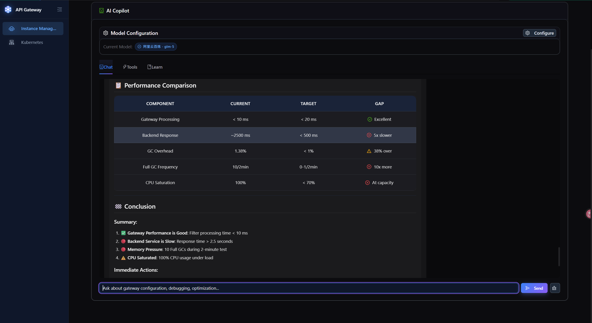

# Feature Screenshots Guide

> Complete visual documentation of all API Gateway features - 66 annotated screenshots covering the entire platform.

---

## Table of Contents

| Feature Module | Screenshot Numbers |
|---------|---------|
| [1. Login](#1-login-01png) | 01 |
| [2. Kubernetes Cluster Management](#2-kubernetes-cluster-management-02-05png) | 02-05 |
| [3. Gateway Instance Management](#3-gateway-instance-management-06-09png) | 06-09 |
| [4. Nacos Configuration Center](#4-nacos-configuration-center-10-11png) | 10-11 |
| [5. Service Management](#5-service-management-12png) | 12 |
| [6. AI Copilot - Route Creation](#6-ai-copilot---route-creation-13-16png) | 13-16 |
| [7. Multi-Service Routing / Gray Release](#7-multi-service-routing--gray-release-17png) | 17 |
| [8. Strategy Configuration](#8-strategy-configuration-18-20png) | 18-20 |
| [9. SSL Certificate Management](#9-ssl-certificate-management-21-22png) | 21-22 |
| [10. Request Tracing](#10-request-tracing-23png) | 23 |
| [11. Real-time Monitoring](#11-real-time-monitoring-24-31png) | 24-31 |
| [12. Alert Configuration](#12-alert-configuration-32png) | 32 |
| [13. Access Logs](#13-access-logs-33-35png) | 33-35 |
| [14. Audit Logs](#14-audit-logs-36-37png) | 36-37 |
| [15. System Diagnostic](#15-system-diagnostic-38-39png) | 38-39 |
| [16. Traffic Topology](#16-traffic-topology-40png) | 40 |
| [17. Filter Chain Analysis](#17-filter-chain-analysis-41png) | 41 |
| [18. Stress Testing](#18-stress-testing-42-49png) | 42-49 |
| [19. AI Copilot - 404 Debugging](#19-ai-copilot---404-debugging-50-54png) | 50-54 |
| [20. AI Copilot - Stress Test Analysis](#20-ai-copilot---stress-test-analysis-55-63png) | 55-63 |
| [21. AI Copilot - Route Disabled Analysis](#21-ai-copilot---route-disabled-analysis-64-66png) | 64-66 |

---

## 1. Login (01.png)

System login interface with username/password authentication. Default admin credentials: admin/admin123.

---

## 2. Kubernetes Cluster Management (02-05.png)

Complete cluster management workflow: add cluster, test connection, view details.

---

## 3. Gateway Instance Management (06-09.png)

Instance list, create instance, instance overview, 404 after creation (no routes configured).

---

## 4. Nacos Configuration Center (10-11.png)

Nacos configuration list and service details (configuration/registry center).

---

## 5. Service Management (12.png)

Manage backend microservices, showing service instance list, health status, and weight configuration.

---

## 6. AI Copilot - Route Creation (13-16.png)

Create routes via natural language, specify target services, successful invocation.

---

## 7. Multi-Service Routing / Gray Release (17.png)

Header-based traffic splitting strategy (gray release/canary deployment).

---

## 8. Strategy Configuration (18-20.png)

Supported strategy types: IP allowlist/blocklist, rate limiting, circuit breaker, timeout, retry, degradation, and authentication configuration.

---

## 9. SSL Certificate Management (21-22.png)

Certificate upload, certificate details, validity monitoring.

---

## 10. Request Tracing (23.png)

Jaeger distributed tracing integration, showing complete request chain.

---

## 11. Real-time Monitoring (24-31.png)

Comprehensive monitoring: JVM, GC, threads, CPU, HTTP metrics, historical trends, Pod selection, route table.

---

## 12. Alert Configuration (32.png)

Email alert setup with threshold configuration (CPU, memory, response time, etc.).

---

## 13. Access Logs (33-35.png)

Access log configuration (Kubernetes PVC mode) and log viewer.

---

## 14. Audit Logs (36-37.png)

Configuration change history with diff comparison and one-click rollback.

---

## 15. System Diagnostic (38-39.png)

Health check (Nacos, Redis, database, JVM) and diagnostic report.

---

## 16. Traffic Topology (40.png)

Real-time traffic visualization showing request paths and service health status.

---

## 17. Filter Chain Analysis (41.png)

Filter performance analysis with bottleneck identification and optimization recommendations.

---

## 18. Stress Testing (42-49.png)

Stress test configuration, execution, real-time monitoring (including Pod resource changes), and report export.

---

## 19. AI Copilot - 404 Debugging (50-54.png)

User claims request returns 404, but AI Copilot queries through tools and discovers the route actually matches, disproving the user's 404 conclusion.

---

## 20. AI Copilot - Stress Test Analysis (55-63.png)

AI Copilot analyzes stress test results from the last two minutes based on real database and Prometheus data, providing professional analysis and optimization recommendations.

---

## 21. AI Copilot - Route Disabled Analysis (64-66.png)

User disabled all routes and asks why 404 occurs. AI Copilot correctly answers: all routes are disabled, so requests cannot match any route, resulting in 404.

---

## Quick Reference

| Feature Module | Screenshot Numbers | Count |
|---------|---------|---------|
| Login | 01 | 1 |
| Kubernetes Cluster Management | 02-05 | 4 |
| Gateway Instance Management | 06-09 | 4 |
| Nacos Configuration Center | 10-11 | 2 |
| Service Management | 12 | 1 |
| AI Copilot - Route Creation | 13-16 | 4 |
| Multi-Service Routing / Gray Release | 17 | 1 |
| Strategy Configuration | 18-20 | 3 |
| SSL Certificate Management | 21-22 | 2 |
| Request Tracing | 23 | 1 |
| Real-time Monitoring | 24-31 | 8 |
| Alert Configuration | 32 | 1 |
| Access Logs | 33-35 | 3 |
| Audit Logs | 36-37 | 2 |
| System Diagnostic | 38-39 | 2 |
| Traffic Topology | 40 | 1 |
| Filter Chain Analysis | 41 | 1 |
| Stress Testing | 42-49 | 8 |
| AI Copilot - 404 Debugging | 50-54 | 5 |
| AI Copilot - Stress Test Analysis | 55-63 | 9 |
| AI Copilot - Route Disabled Analysis | 64-66 | 3 |
| **Total** | **01-66** | **66** |
